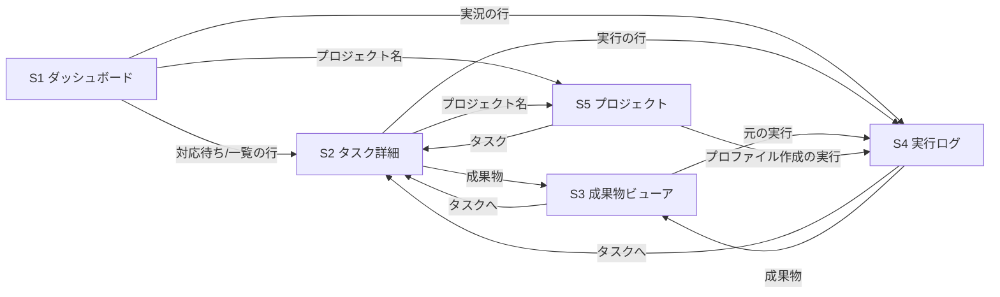

# 構造(GUI・フェーズ2)

要件は `docs/scope.md`。

## 画面一覧

| ID | 画面 | URL | 機能 |
|----|------|-----|------|
| S1 | ダッシュボード | `/` | F1 対応待ち、F2 実況、F3 タスク一覧 |
| S2 | タスク詳細 | `/tasks/:id` | F4、F9 |
| S3 | 成果物ビューア | `/tasks/:id/artifacts/:artifactId` | F5 |
| S4 | 実行ログ | `/runs/:id` | F6 |
| S5 | プロジェクト | `/projects/:id` | F7 |

すべての画面に共通ヘッダー(ロゴ、プロジェクトへの切り替え、SSE の接続状態、「読み取り専用」の表示)を置く。

## 画面遷移

## データモデル(読み取りAPI)

正本は SQLite(設計メモ12章)。GUI はサーバーの読み取り専用 JSON API だけを使う。型は `src/server/api-types.ts` に置き、サーバーと GUI で共有する(フェーズ3で書き込みAPIを足すときも同じ型を使う)。

| API | 返すもの | 使う画面 |
|-----|----------|----------|
| `GET /api/overview` | プロジェクト一覧、タスクの要約(状態、実行中の役割、対応待ちの理由)、実行中の実行 | S1 |
| `GET /api/projects/:id` | プロジェクト、プロファイル、リポジトリ、`decisions.md` の本文、プロジェクト把握担当の実行、タスクの要約 | S5 |
| `GET /api/tasks/:id` | タスク、worktree、承認(有効/失効)、成果物、実行の一覧、費用と時間の合計、対応待ちの理由、次の CLI コマンド | S2 |
| `GET /api/artifacts/:id` | 成果物のメタ情報と本文(テキストなら)、画像なら `/files/` のURL | S3 |
| `GET /api/runs/:id` | 実行のメタ情報(役割、モデル、状態、判定、要約、エラー、費用、時間)と、生ログのURL | S4 |
| `GET /api/events?after=&task=&run=&limit=` | イベント(id 昇順)。`after` 以降だけを返す | S1, S2, S4 |
| `GET /api/stream`(SSE) | `change`(タスク・実行が変わった)と `events`(新しいイベント)を送る | 全画面 |
| `GET /files/<相対パス>` | 成果物の置き場所のファイル(既存。`tasks/` `projects/` `runs/` 以外は配信しない) | S3, S4 |

### 要約の主な項目

- タスクの要約: `id`, `projectId`, `title`, `kind`, `state`, `heldFromState`, `assignee`, `reviewRounds`, `updatedAt`, `attention`(対応待ちの種類: `approve_plan` / `approve_final` / `answer` / `failed` / `human_working` / なし), `reason`(回答待ちの質問・失敗の理由), `running`(実行中の役割とモデル、開始時刻)
- 次の CLI コマンド(F9)はサーバー側で状態から組み立てる(状態とコマンドの対応はオーケストレーターの知識なので、GUI に持たせない)

### 即時反映(SSE)

- オーケストレーター(`agent-crew run`)は別のプロセスで DB に書く。サーバーは DB を1秒ごとに見て、`events` の最大 id と、`tasks` / `runs` の更新の印が変わったら通知する
- `events` は `after` 以降を送り、GUI は表示中のリストに追記する。`change` を受けた画面は、自分の API を取り直す
- 再接続時は `Last-Event-ID` で取りこぼしを補う
